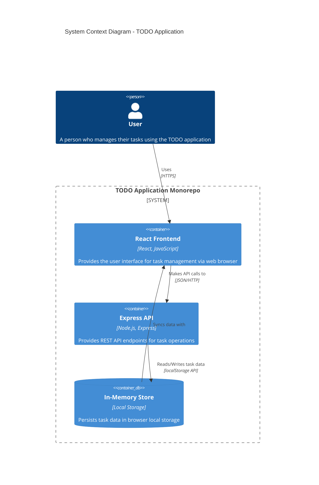
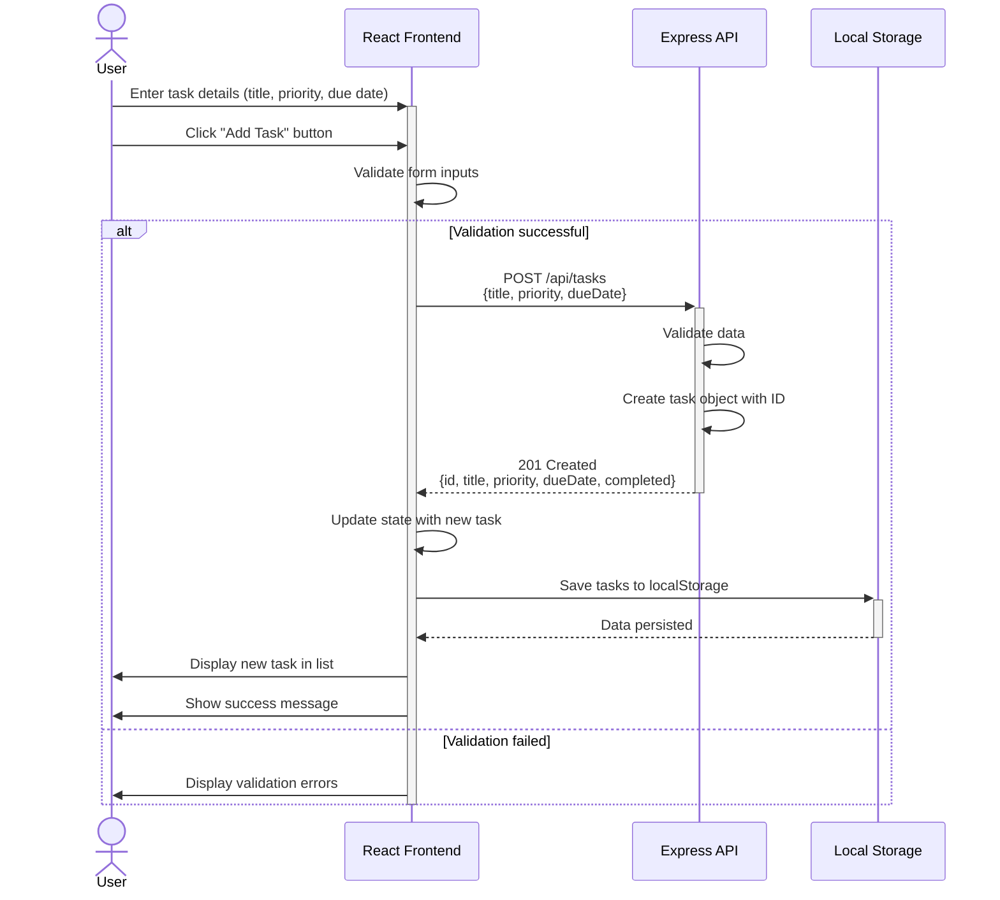

# Cloud Architecture Overview - TODO App

## System Context

This document provides a high-level architectural overview of the TODO application monorepo, illustrating the key components and their interactions.

## Architecture Diagram

## Component Overview

### React Frontend
- **Technology**: React, JavaScript
- **Location**: `packages/frontend/`
- **Responsibilities**:
  - User interface for creating, viewing, editing, and deleting tasks
  - Task filtering (All, Today, Overdue)
  - Priority and due date management
  - Client-side state management
  - Local storage synchronization

### Express API
- **Technology**: Node.js, Express
- **Location**: `packages/backend/`
- **Responsibilities**:
  - RESTful API endpoints for CRUD operations
  - Data validation
  - Business logic for task management
  - In the current implementation, serves as a backend framework (can be extended)

### In-Memory Store
- **Technology**: Browser Local Storage
- **Responsibilities**:
  - Persistent storage of task data in the browser
  - JSON-based data serialization
  - No external database required for MVP
  - Data persists across browser sessions

## Data Flow

1. **User Interaction**: User interacts with the React frontend through the browser
2. **API Communication**: Frontend sends HTTP requests to the Express backend for task operations
3. **Data Persistence**: Task data is stored in browser's local storage
4. **Data Retrieval**: On page load, frontend retrieves task data from local storage
5. **State Management**: React manages application state and re-renders UI based on data changes

## Sequence Diagram - Creating a TODO

The following sequence diagram illustrates the interaction flow when a user creates a new TODO task:

## Deployment Architecture

### Current State (Development)
- **Frontend**: Runs on `http://localhost:3000` via React development server
- **Backend**: Runs on `http://localhost:3001` via Express server
- **Storage**: Browser local storage (client-side)

### Future Considerations (Out of MVP Scope)
- Cloud hosting (e.g., AWS, Azure, Vercel)
- Database integration (e.g., PostgreSQL, MongoDB)
- Authentication and multi-user support
- API gateway and load balancing
- CDN for static assets

## Technology Stack Summary

| Component | Technology | Purpose |
|-----------|-----------|---------|
| Frontend Framework | React | UI components and state management |
| Backend Framework | Express.js | REST API server |
| Runtime | Node.js | JavaScript runtime for backend |
| Package Manager | npm workspaces | Monorepo dependency management |
| Data Storage | Local Storage | Client-side persistent storage |
| Testing | Jest | Unit and integration testing |
| Styling | CSS, Material UI | UI component styling |

## Key Architectural Decisions

1. **Monorepo Structure**: Both frontend and backend reside in the same repository for simplified development and coordination
2. **Local Storage**: MVP uses browser local storage instead of a database to minimize complexity
3. **REST API**: Standard HTTP REST API for communication between frontend and backend
4. **No Authentication**: MVP does not include user authentication or multi-user support
5. **Client-Side State**: Task state is managed primarily on the client side with local storage persistence
